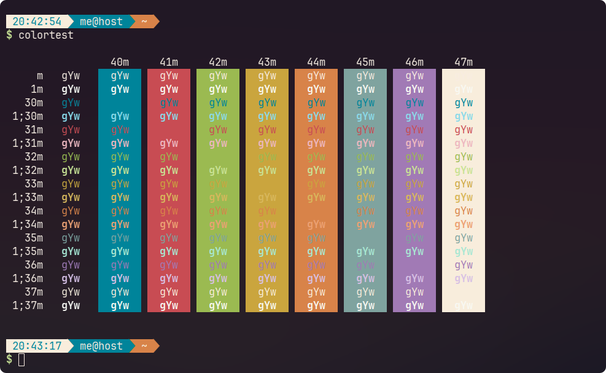

<h1 align="center">
	
    <br/>
	Emberstone for Konsole
</h1>

## Preview


## 🚧 Alpha Stage Notice

**Emberstone is currently in its ALPHA phase.** This means the themes are still in development, and we are actively iterating on design, color palettes, and compatibility. Contributions and feedback are highly appreciated as we work towards our first stable release.

## Requirement

This plugins have been tested on Konsole post 2015.

## Installation

### Automatic

Execute this command :

```bash
curl -s https://raw.githubusercontent.com/Emberstone-theme/konsole/main/install.sh
```
This command will download extract and install the theme on your Konsole folder.

You can then configure Konsole to use Emberstone theme.

### Manual

1. Download and extract [the latest version](https://github.com/emberstone-theme/konsole/archive/main.zip)
2. Copy `Emberstone.colorscheme` to `~/.local/share/konsole`

You can then configure Konsole to use Emberstone theme.

## Configure Konsole

Once the installation is complete, follow these steps:

1. Go to Konsole > Settings > Edit Current Profile… > Appearance tab
2. Select Emberstone from _Color Schemes & Background_

## Side notes

The preview uses Konsole with [Oh-my-zsh](https://github.com/ohmyzsh/ohmyzsh) themed with [Bullettrain](https://github.com/caiogondim/bullet-train.zsh).

<hr/>

<p align="center">
  Distributed under the MIT License. © 2024 <a href="https://github.com/emberstone-theme">Emberstone Theme</a>
</p>
